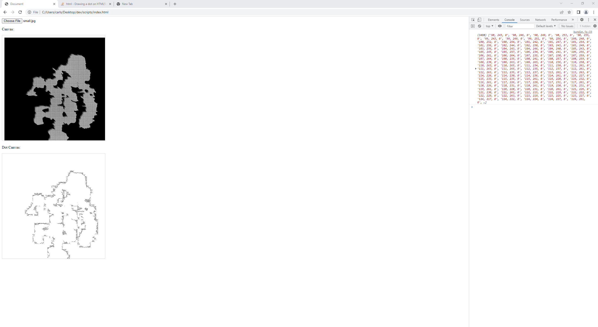

# ImageOutliner

## Takes an image and gives you the coordinates of the outlines in several csv files to be fed into Blender

## Commands
`npm install -g browserify`

`npm install`

`npm run build`

`npm run start`

    Go to google chrome (fastest)

    Upload your image

    Notice that it creates your csvs

    Uploade them into Blender one at a time, (it might take some time each time).
    Python script is available a script.py

    Step1: out_0.csv

    Step2: out_1.csv

    Step3: out_2.csv

    Step4: out_3.csv

    Result!
   

